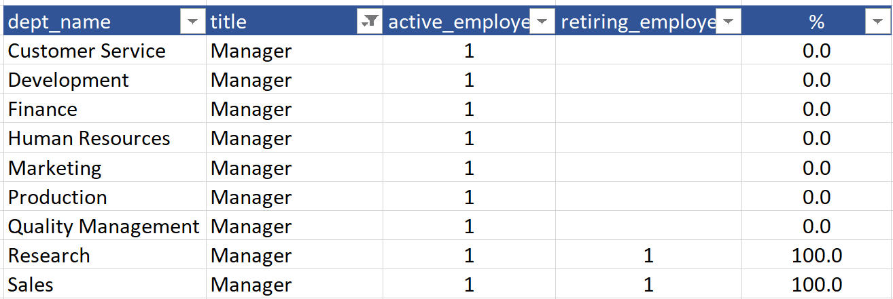

# Pewlett-Hackard-Analysis

## Overview

- Pewlett Hackard is a large company that will face in the next years the retirement of many employees a "silver tsunami".
- To be prepared the company needs to answer to questions:
  1. Wich employees could qualify to a retirement package?
  2. Wich positions needs to be filled in the near future?

## Results

### Database design

- A new database was designed and created to organize and analyze the data:


### General results

- There are 300,024 employees registered in the database
  - 240,124 current (active)
  - 13.8 % of them (33,118) will be retiring soon

### Results by department

- All Departments have similar % of Retiring Employees:

| Departement | Active Employees | Retiring Employees | % |
|---|:---:|:---:|:---:|
| Development | 61386 |	8361 |	13.6 |
| Production |	53304 |	7417 |	13.9 |
| Sales |	37701 |	5252 |	13.9 |
| Customer Service |	17569 |	2387 |	13.6 |
| Research |	15441 |	2198 |	14.2 |
| Quality Management |	14546 |	2048 |	14.1 |
| Marketing |	14842 |	1987 |	13.4 |
| Human Resources |	12898 |	1771 |	13.7 |
| Finance |	12437 |	1697 |	13.6 |
| TOTAL | 240124 | 33118 | 13.8 |

### Results by position

#### Management positions

- 2 of 9 managers will be retiring


#### Non-Management positions

- 12 positions will be retiring above 15% of the employees


#### Mentorship program

- 1,549 Employees are candidates for participating as mentors (born in 1965)

## Relevant Queries

```SQL
-- Registered Employees in the Database
SELECT
    count(emp_no) 
FROM 
    employees
```

```SQL
-- Last Title per Employee
DROP TABLE out_last_title;


SELECT DISTINCT ON (emp_no)
	emp_no,
	title,
	to_date
INTO
	out_last_title
FROM
	titles
ORDER BY
	emp_no ASC,
	to_Date DESC;
	
	
SELECT * FROM out_last_title;
```

```SQL
-- Current employees by department
DROP TABLE out_current_emp;

SELECT 
	em.emp_no,
    em.first_name,
    em.last_name,
	de.dept_no,
	d.dept_name,
	lt.title,
	de.to_date
INTO
	out_current_emp
FROM
	employees as em
LEFT JOIN
	dept_emp as de
		ON de.emp_no = em.emp_no
LEFT JOIN
	departments as d
		ON d.dept_no = de.dept_no
LEFT JOIN
	out_last_title as lt
		ON	lt.emp_no = em.emp_no
WHERE 
	de.to_date = ('9999-01-01');

SELECT * FROM out_current_emp;
```

```SQL
-- Current Employees Count by department
DROP TABLE out_current_emp_count_by_dept;

SELECT
	dept_name,
	count(emp_no) as active_employees
INTO
	out_current_emp_count_by_dept
FROM
	out_current_emp as oce
GROUP BY
	dept_name
ORDER BY
	count(emp_no) DESC;
	
SELECT * FROM out_current_emp_count_by_dept;
```

```SQL
-- Create new table for current employees retiring
DROP TABLE out_retirement_info;


SELECT
	em.emp_no, 
	em.first_name, 
	em.last_name,
	em.gender,
	em.birth_date,
	em.hire_date,
	d.dept_name,
	lt.title
INTO 
	out_retirement_info
FROM 
	employees as em
INNER JOIN
	dept_emp as d_e
		ON d_e.emp_no = em.emp_no
INNER JOIN
	departments as d
		ON d.dept_no = d_e.dept_no
INNER JOIN
	out_last_title as lt
		ON	lt.emp_no = em.emp_no
WHERE 
	d_e.to_date = ('9999-01-01')
	AND (birth_date BETWEEN '1952-01-01' AND '1955-12-31')
	AND (hire_date BETWEEN '1985-01-01' AND '1988-12-31');


SELECT * FROM out_retirement_info;
```

```SQL
-- Retiring Employees Count by department
DROP TABLE out_retiring_emp_count_by_dept;


SELECT
	dept_name,
	count(emp_no) as retiring_employees
INTO
	out_retiring_emp_count_by_dept
FROM
	out_retirement_info
GROUP BY
	dept_name
ORDER BY
	count(emp_no) DESC;
	

SELECT * FROM out_retiring_emp_count_by_dept;
```

```SQL
-- Join active and retiring by department

SELECT
	cu.dept_name,
	cu.active_employees,
	re.retiring_employees,
	CAST(re.retiring_employees as DECIMAL(12,0)) / CAST(cu.active_employees as DECIMAL(12,0)) as department_perc
FROM
	out_retiring_emp_count_by_dept as re
LEFT JOIN
	out_current_emp_count_by_dept as cu
		ON cu.dept_name = re.dept_name
```

```SQL
-- Active and Retiring Employees by Position
SELECT
	t1.dept_name,
	t1.title,
	t1.positions as active_employees,
	t2.positions as retiring_employees
FROM
(
SELECT
	dept_name,
	title,
	CONCAT(dept_name,'_',title) as dept_title,
	count(title) as positions
FROM
	out_current_emp
GROUP BY
	dept_name,
	title
ORDER BY
	CONCAT(dept_name,'_',title) ASC
) as t1
LEFT JOIN 
(
SELECT
	dept_name,
	title,
	CONCAT(dept_name,'_',title) as dept_title,
	count(title) as positions
FROM
	out_retirement_info
GROUP BY
	dept_name,
	title
ORDER BY
	CONCAT(dept_name,'_',title) ASC
) as t2
ON t1.dept_title = t2.dept_title
```

## Summary

- 13.8% of the employees will be retiring soon (33,118 positions)
- Special focus should be given to Research and Sales department as the managers are part of the "silver tsunami"
- Production will be especially stressed as 18.5% of their Senior Staff will be retiring.
- Under the current criteria only 1,549 employees are candidates to guide as mentors, broader criteria should be used to increase the number of participants.
